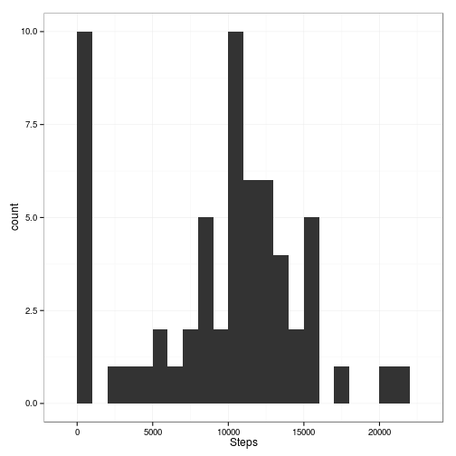
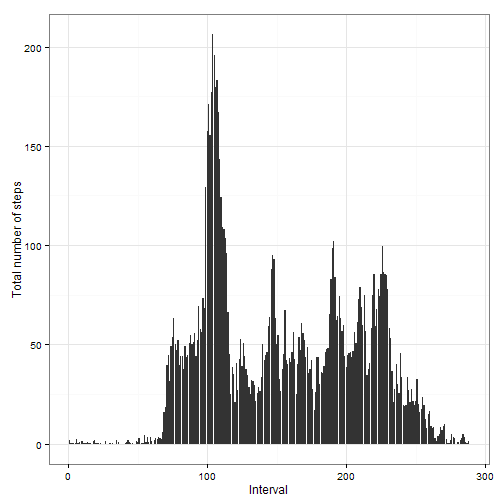
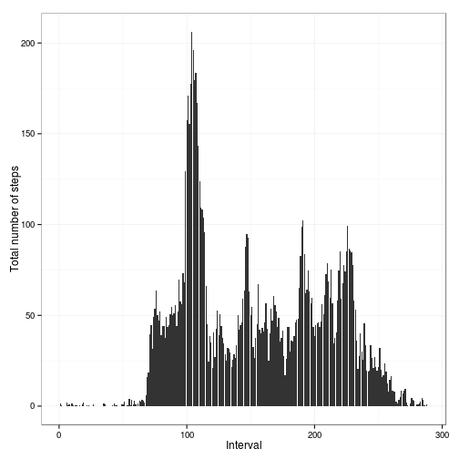

# Reproducible Research: Peer Assessment 1


## Loading and preprocessing the data


```r
data <- read.csv(unz("activity.zip", "activity.csv"), header = T, colClasses = c("numeric", 
    "character", "numeric"))

data$interval <- factor(data$interval)
data$date <- as.Date(data$date, format = "%Y-%m-%d")
```


## What is mean total number of steps taken per day?


```r
daily_steps <- aggregate(data$steps, by = list(Date = data$date), FUN = sum, 
    na.rm = T)
names(daily_steps)[2] <- c("Steps")

library(ggplot2)
library(scales)

ggplot(daily_steps, aes(x = Date, y = Steps)) + geom_bar(stat = "identity") + 
    theme_bw() + labs(x = "Day", y = "Total number of steps") + scale_x_date(labels = date_format("%m-%d"))
```

 

  
**Mean: 9354
**Median: 10395

## What is the average daily activity pattern?


```r
interval_steps <- aggregate(data$steps, by = list(Interval = data$interval), 
    FUN = mean, na.rm = T)
interval_steps$num <- as.numeric(interval_steps$Interval)
names(interval_steps)[2] <- c("Steps")

max_interval <- interval_steps[which.max(interval_steps$Steps), ]$num

ggplot(interval_steps, aes(x = num, y = Steps)) + geom_bar(stat = "identity") + 
    theme_bw() + labs(x = "Interval", y = "Total number of steps")
```

```
## Warning: position_stack requires constant width: output may be incorrect
```

 


## Imputing missing values


## Are there differences in activity patterns between weekdays and weekends?


```r
data$weekday <- as.factor(weekdays(data$date))
weekend_data <- subset(data, weekday %in% c("Saturday", "Sunday"))
weekday_data <- subset(data, !weekday %in% c("Saturday", "Sunday"))

weekend_steps <- aggregate(weekend_data$steps, by = list(Interval = weekend_data$interval), 
    FUN = mean, na.rm = T)
weekend_steps$num <- as.numeric(weekend_steps$Interval)
names(weekend_steps)[2] <- c("Steps")

weekday_steps <- aggregate(weekday_data$steps, by = list(Interval = weekday_data$interval), 
    FUN = mean, na.rm = T)
weekday_steps$num <- as.numeric(weekday_steps$Interval)
names(weekday_steps)[2] <- c("Steps")

weekend_steps$dayofweek <- rep("weekend", nrow(weekend_steps))
weekday_steps$dayofweek <- rep("weekday", nrow(weekday_steps))

data_by_weekday <- rbind(weekend_steps, weekday_steps)
data_by_weekday$dayofweek <- as.factor(data_by_weekday$dayofweek)

ggplot(data_by_weekday, aes(x = num, y = Steps)) + geom_bar(stat = "identity") + 
    theme_bw() + labs(x = "Interval", y = "Total number of steps") + facet_wrap(~dayofweek, 
    nrow = 2, ncol = 1)
```

```
## Warning: position_stack requires constant width: output may be incorrect
## Warning: position_stack requires constant width: output may be incorrect
```

 

