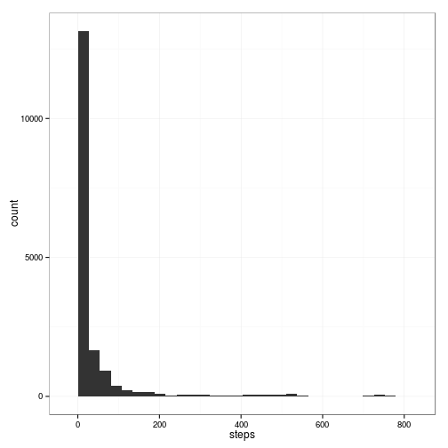
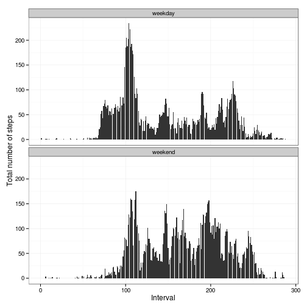

# Reproducible Research: Peer Assessment 1


## Loading and preprocessing the data


```r
data <- read.csv(unz("activity.zip", "activity.csv"), header = T, colClasses = c("numeric", 
    "character", "numeric"))

data$interval <- factor(data$interval)
data$date <- as.Date(data$date, format = "%Y-%m-%d")
```


## What is mean total number of steps taken per day?


```r
daily_steps <- aggregate(data$steps, by = list(Date = data$date), FUN = sum, 
    na.rm = T)
names(daily_steps)[2] <- c("Steps")

library(ggplot2)
library(scales)

ggplot(daily_steps, aes(Steps)) + geom_histogram(binwidth = 1000) + theme_bw()
```

 


```r
summary(daily_steps)
```

```
##       Date                Steps      
##  Min.   :2012-10-01   Min.   :    0  
##  1st Qu.:2012-10-16   1st Qu.: 6778  
##  Median :2012-10-31   Median :10395  
##  Mean   :2012-10-31   Mean   : 9354  
##  3rd Qu.:2012-11-15   3rd Qu.:12811  
##  Max.   :2012-11-30   Max.   :21194
```

  
Mean: 9354
Median: 10395

## What is the average daily activity pattern?


```r
interval_steps <- aggregate(data$steps, by = list(Interval = data$interval), 
    FUN = mean, na.rm = T)
interval_steps$num <- as.numeric(interval_steps$Interval)
names(interval_steps)[2] <- c("Steps")

max_interval <- interval_steps[which.max(interval_steps$Steps), ]$num

ggplot(interval_steps, aes(x = num, y = Steps)) + geom_bar(stat = "identity") + 
    theme_bw() + labs(x = "Interval", y = "Total number of steps")
```

```
## Warning: position_stack requires constant width: output may be incorrect
```

 


```r
summary(interval_steps)
```

```
##     Interval       Steps             num       
##  0      :  1   Min.   :  0.00   Min.   :  1.0  
##  5      :  1   1st Qu.:  2.49   1st Qu.: 72.8  
##  10     :  1   Median : 34.11   Median :144.5  
##  15     :  1   Mean   : 37.38   Mean   :144.5  
##  20     :  1   3rd Qu.: 52.83   3rd Qu.:216.2  
##  25     :  1   Max.   :206.17   Max.   :288.0  
##  (Other):282
```


Maximum activity is observed in interval 104.

## Imputing missing values

Missing values are imputed with the mean value at the corrresponding interval.


```r
missing <- which(is.na(data$steps))
temp <- interval_steps
imputed_steps <- data$steps
imputed_steps[missing] <- unlist(lapply(missing, FUN = function(idx) {
    interval = data[idx, ]$interval
    temp[temp$Interval == interval, ]$Steps
}))

imputed_data <- data.frame(steps = imputed_steps, date = data$date, interval = data$interval)

ggplot(imputed_data, aes(steps)) + geom_histogram() + theme_bw()
```

```
## stat_bin: binwidth defaulted to range/30. Use 'binwidth = x' to adjust this.
```

 


```r
summary(imputed_data)
```

```
##      steps            date               interval    
##  Min.   :  0.0   Min.   :2012-10-01   0      :   61  
##  1st Qu.:  0.0   1st Qu.:2012-10-16   5      :   61  
##  Median :  0.0   Median :2012-10-31   10     :   61  
##  Mean   : 37.4   Mean   :2012-10-31   15     :   61  
##  3rd Qu.: 27.0   3rd Qu.:2012-11-15   20     :   61  
##  Max.   :806.0   Max.   :2012-11-30   25     :   61  
##                                       (Other):17202
```


## Are there differences in activity patterns between weekdays and weekends?


```r
data$weekday <- as.factor(weekdays(data$date))
weekend_data <- subset(data, weekday %in% c("Saturday", "Sunday"))
weekday_data <- subset(data, !weekday %in% c("Saturday", "Sunday"))

weekend_steps <- aggregate(weekend_data$steps, by = list(Interval = weekend_data$interval), 
    FUN = mean, na.rm = T)
weekend_steps$num <- as.numeric(weekend_steps$Interval)
names(weekend_steps)[2] <- c("Steps")

weekday_steps <- aggregate(weekday_data$steps, by = list(Interval = weekday_data$interval), 
    FUN = mean, na.rm = T)
weekday_steps$num <- as.numeric(weekday_steps$Interval)
names(weekday_steps)[2] <- c("Steps")

weekend_steps$dayofweek <- rep("weekend", nrow(weekend_steps))
weekday_steps$dayofweek <- rep("weekday", nrow(weekday_steps))

data_by_weekday <- rbind(weekend_steps, weekday_steps)
data_by_weekday$dayofweek <- as.factor(data_by_weekday$dayofweek)

ggplot(data_by_weekday, aes(x = num, y = Steps)) + geom_bar(stat = "identity") + 
    theme_bw() + labs(x = "Interval", y = "Total number of steps") + facet_wrap(~dayofweek, 
    nrow = 2, ncol = 1)
```

```
## Warning: position_stack requires constant width: output may be incorrect
## Warning: position_stack requires constant width: output may be incorrect
```

 

